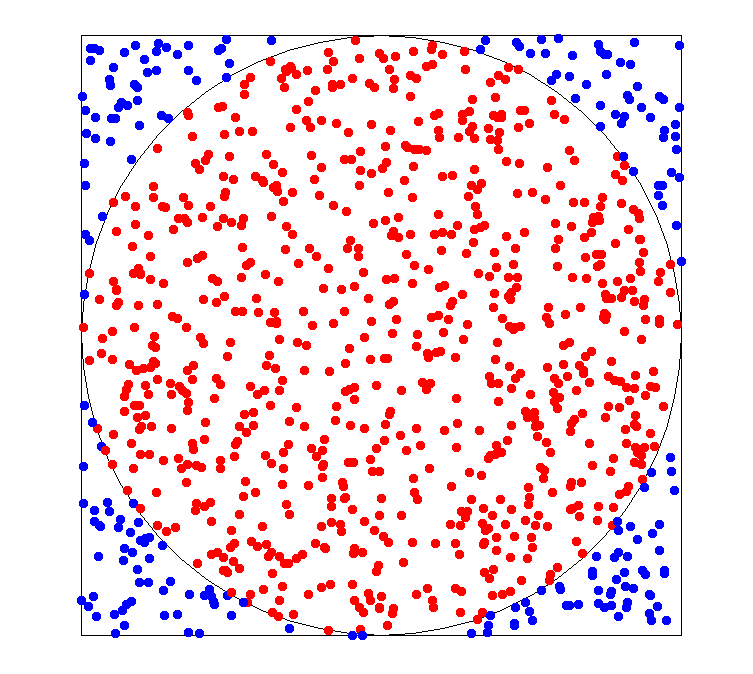
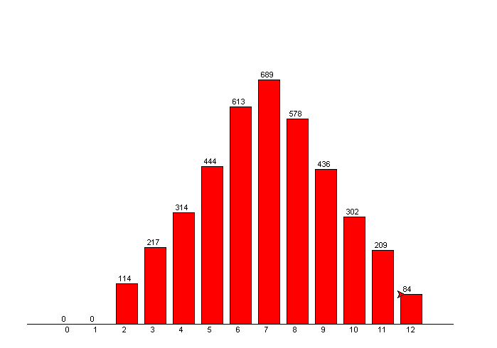

# 第 3 周作业

蒙特卡罗法（随机数模拟法）是计算机常用的一种方法，通过随机数模拟来求解问题。 

以下两个内容选做一个（要求使用 `list`及 `turtle`)： 

## 作业 3.1 

**求圆周率 π 。** 一个边长为2r的正方形内有一个内切圆，现在随机向正方形内撒 n 个点，如果点落在圆内有  m个点，则 m/n 约等于 π/4 (面积比），或者说 π=m/n*4，从而求出 π。试模拟并计算π的值。
（提示：用与圆心的距离可以判断是否在圆内），并且用 turtle 画出来正方形、圆以及各个点。 

Tips: 

* 蒙特卡洛方法的介绍可以参见 [这里](https://en.wikipedia.org/wiki/Monte_Carlo_method)。
* 不要把自己的文件命名为 `turtle` 或者其他 Python Packages 的名字。

参考结果：

## 作业 3.2

麻将的色子，数字可以为 1 到 6。每次执出两个色子，问它们的和最大可能性是几。程序模拟很多次，每次产生两个 1 到 6 之间的随机数，求其和数(记为 n )。为了统计某个 n 出现多少次，可以给一个 13 个元素的列表 `cnts=[0]*13`，每次 `cnts[n]+=1` 。最后求出列表 cnts 中的最大数的下标，并用 turtle 图画出来，可以用柱状图表示每个和数的出现次数。 

关于 turtle，需要你自主学习一下，可以见 [turtle 的官方文档](https://docs.python.org/3.6/library/turtle.html)

Tips:

* 画矩形图需要使用 `turtle`，而不能使用成熟的图标库比如 `matplotlib`

参考结果：

